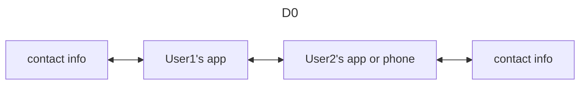
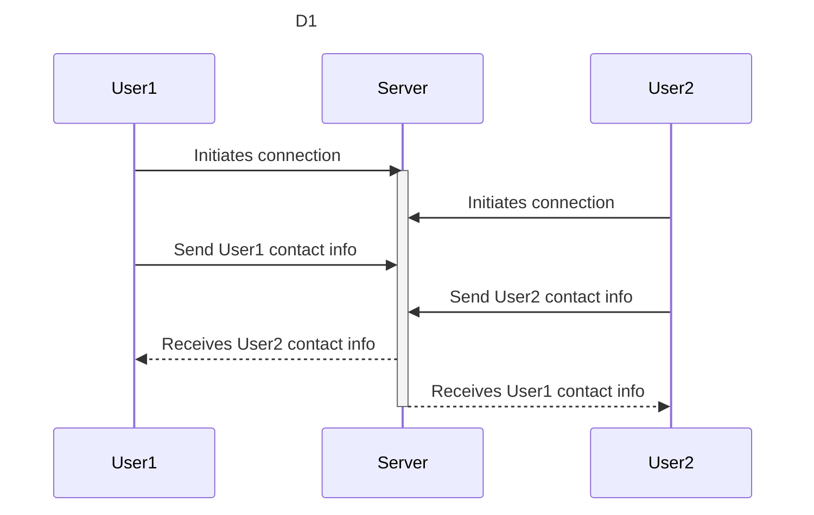
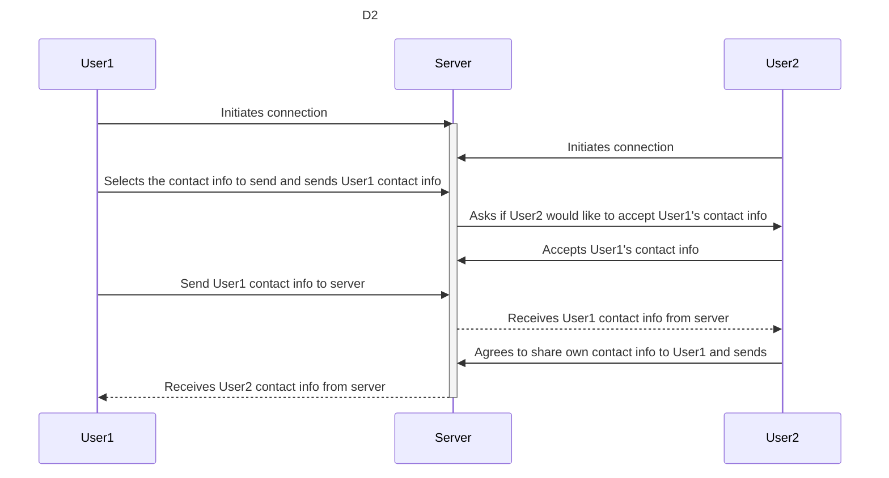

# Placeholder Group
**Goal statement:** Our app makes it easy to share and manage the correct contact info with the correct people.

## User Stories

- As a person with both a personal and professional life, I want to quickly and easily share and exchange the correct contact information with the correct people.
- As a college student I want to connect with my peers, both professionally and personally.
- As a business professional at a networking event, I want  to easily and quickly exchange my business contact info with someone I just met.
- As a person who just met a new friend I want to easily and quickly be able to share my personal contact info with them.
- As a content creator, I want to be able to share my many different social media profiles with a lot of people at social events.

## Design Diagrams

- **Box:** Actors
- **Solid Line:** Generic message
- **Dotted Line:** Response

### D0
User 1 inputs contact info into their app. That contact info can be sent to user 2's app. That same contact info is then the output of user 2's app. This process is the same but reversed for sending contact info from user 2 to user 1.

### D1

### D2
